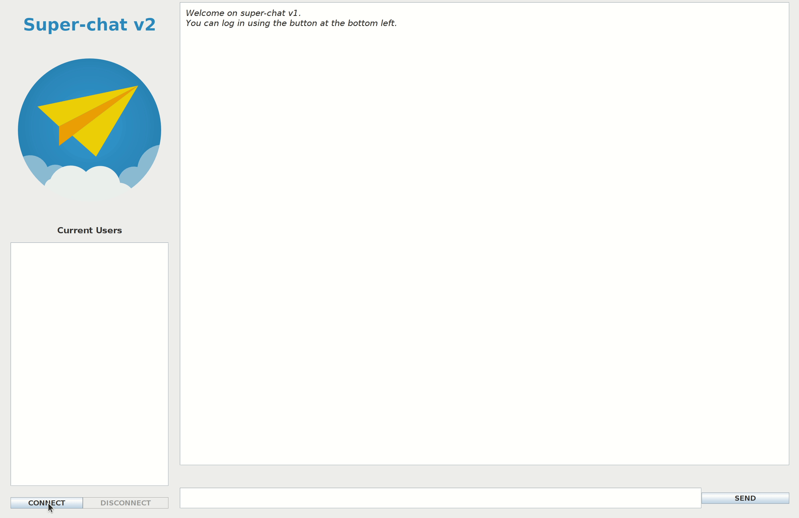

[](https://shields.io/)

<div align="center">
	<br>
	<br>
	
	<h1>Superchat v2</h1>
	<p>
	<b>An online chat for several users using the Java RabbitMQ library, and Swing.</b>
	</p>
	<br>
	<br>
	<br>
</div>

## Demonstration

<p align="center">
	
	<br>
</p>

## Description

Based on the _RabbitMQ_ library, the chat consists in one server application, 
and another for clients (i.e. the server application
should be launched on a host, before the clients can launch their one).
Based on the publish-subscribe pattern, everyone follows everyone. However, 
our chat is centralized.

### Features:

* Each client can connect/disconnect whenever they want without leaving
  the application.

* A real-time connected user list is proposed (even for those not connected).

* On connection, the client will receive all the messages not received.

* Server logs indicate connections/disconnections/errors.

* The server will load messages from last sessions on launch, and will save
  them all on exit (by using the file `$HOME/.superchat/history2` on the host).

### Implementation:

* The `Connection` and `Message` classes:

    * Serializable classes transmitted between clients and also the server.
      
    * The first one contains information about the _connection_ and _disconnection_ 
      requests, and the second about the content, sender and time of the _message_. 

* The `Client` class/interface:

    * Created in the `Application` and bound with it.

    * Saves her/his pseudo on the server side by using the a `RPC` pattern
      (i.e. a _request_ queue is created to send `Connection` and `Disconnection`
      requests to the `Server`, and a temporary _response_ queue is created on the
      `Client` side to inform her/his that the request was _accepted_ or _denied_).
      
    * Subscribes to all the other `Clients` to receive their `Messages` and 
      publishes to all their timelines when sending. To do that a `fanout` _exchange_
      is created.

* The `Application` class:

    * The _GUI_ bound with a `Client`; the one launched by a user.

    * Informs the `Client` of the user's inputs so that it can act on them.

* The `Server` class:
    
    * Accepts or denies `Connection` requests, and executes the `Disconnection` 
      ones by updating a list of unique _pseudos_.
      
    * Receives `Messages` from the `Clients`.

    * Retrieves/Saves the message history on launch/exit, in the
      `$HOME/.superchat/history2` file on the host.
      
Here the summary of the exchanges (using `RabbitMQ`) between the `Client` 
and `Server` entities:

<p align="center">
	
	<br>
</p>

### Comparison with Java RMI

* The implementation was much simpler and faster, by the ease of implementing
  patterns.

* The number of lines of code (used only for chat management, not the graphical 
  interface) seems to be lower.
  
From these observations, the library was more appropriate for this kind of 
application. The desired patterns was easy to implement, and in addition 
remote procedure calls could also be used quite easily if needed.

### Possible improvements

* For security issues, the URI associated to the queues/exchanges could be 
  improved, and each pseudo associated to a password (to avoid identity theft).

* For backup issues, the message history file should not be stored on the
  host, but on the client side. We could also save the message history
  every _X_ minutes or every _Y_ messages to avoid loosing them on a power cut
  for example.

* For performance and security issues, limitations and management should be 
  added (maximum number of clients, maximum length of messages, etc.), 
  depending on the host. Also, recovery algorithms should be optimized.

* For ethical issues, the chat itself should not be used this way, because
  it implies a centralization of user data (names, messages, and metadata).
  Since we have already implemented a publish-subscribe traffic model, 
  we could make this chat completely decentralized.
  
* From the previous observations, we could use the concept of _master node_, and
  use a connected client as the server. On her/his disconnection, we could use
  an election algorithm to hand over the responsibilities to another node which
  would be the new _master node_. Our chat would be totally decentralized.
  
* We could also improve the previous concept by using multiple _master nodes_,
  mainly for security issues (but also for performances).

## Instructions

1. First you need to install _RabbitMQ_ on your computer:

   ```console
   user:~/Java-RabbitMQ-Chat/ $ sudo apt install rabbitmq-server
   ```
   
   > You may also need to launch the server using the `sudo rabbitmq-server` command.
   
2. Next you need first to start the `Server`. To do this you have
   to execute the following command:

   * If you are trying to launch the `Server` on `localhost`:
    
      ```console
      user:~/Java-RabbitMQ-Chat/ $ mvn compile exec:java -Dexec.mainClass=superchat.Server 
      ```
    
   * Otherwise, if you want to launch it on `<host>`: 
     
      ```console
      user:~/Java-RabbitMQ-Chat/ $ mvn compile exec:java -Dexec.mainClass=superchat.Server -Dexec.args=<host>
      ```

3. Then to start a user connection:

   ```console
   user:~/Java-RabbitMQ-Chat/ $ mvn compile exec:java -Dexec.mainClass=superchat.Application 
   ```

   > If you aren't using `localhost`, as said previously, you should also use `-Dexec.args=<host>`.
    
## Troubleshooting

* When executing `Server`: 
  
  ```console
  Error: java.net.ConnectException: Connexion refusée
  ```
  
  > You may need to start the _RabbitMQ server_ with the `sudo rabbitmq-server`
  command. 

* When executing `Application`:
    
  ```console
  Exception in thread "main" java.awt.AWTError: Can't connect to \<X server\> 
  using \<IP address:x.x\> as the value of the DISPLAY variable.
  ```

  > You may need to execute the `export DISPLAY=:0` command.

## Attributions

<div>
	Icon made by 
	<a href="https://www.flaticon.com/authors/flat-icons" title="Flat Icons">Flat Icons</a> 
	from 
	<a href="https://www.flaticon.com/" title="Flaticon">www.flaticon.com</a>
	.
</div>